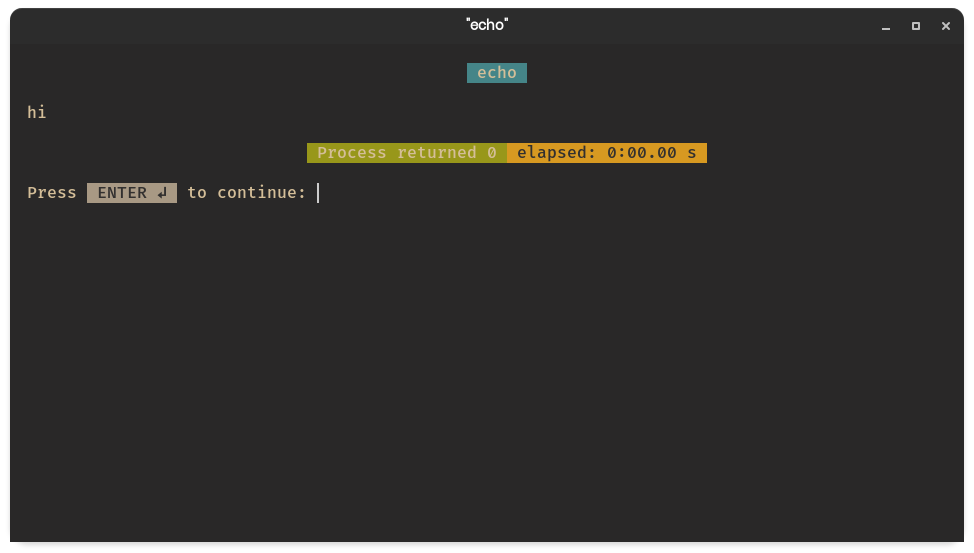

# bash-console-runner
A dirty couple of bash scripts that spawn a terminal emulator with whatever executable you feed to it.  
At the end of the execution it will print the return value and the duration of its execution.



## Install
```bash
git clone https://github.com/Fabrizio-Volonte/bash-console-runner.git
cd bash-console-runner
sudo ./install
```

## Run
To use the script just type:  
`bash-console-runner-start <executable>`
### Example
folder structure:  
📂  
├─ hello_world  
└─ hello_world.c  
run:  
`bash-console-runner-start hello_world`

## Setting Your Terminal Emulator
You will find the xterm terminal hardcoded as a fallback in the bash-console-runner-start script.  
Different terminals handle this in pretty different ways ¯\\\_(ツ)_/¯  

To use your terminal emulator of choice, edit the configuartion file in ~/.config/bash-console-runner/terminal-emulator.conf.  
Either uncomment the terminal command you want to use (if you uncomment multiple the first uncommented will be used) or add your own.  

If you know a terminal that has not been added to the list and you wish to see it added to the configuration then request it in an [issue](https://github.com/Fabrizio-Volonte/bash-console-runner/issues) and kindly provide the command in question.

### Known Commands
* [gnome terminal](https://gitlab.gnome.org/GNOME/gnome-terminal)
  + `gnome-terminal --title=\"$1\" --`
* [kitty](https://github.com/kovidgoyal/kitty)
  + `kitty -T \"$1\"`
* [xterm](https://invisible-island.net/xterm/)
  + `xterm -title \"$1\" -e`


## Other
This can be used in [Visual Studio Code](https://github.com/Microsoft/vscode) as a patch to the missing feature of opening in an external terminal with build tasks.  
### Example configuration
```json
"label": "C (GCC) Compile and Run",
"type": "shell",
"command": "gcc",
"args": 
[  
  "-Wall",
  "-g",
  "${relativeFile}",
  "-o",
  "${fileBasenameNoExtension}",
  "&&",
  "bash-console-runner-start",
  "-disable-nohup",
  "./${fileBasenameNoExtension}",
],
```
